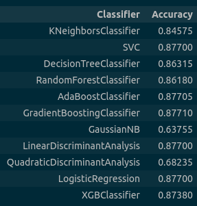
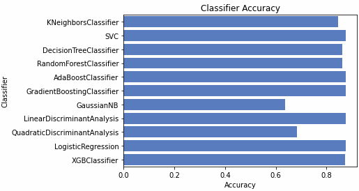

# Health Insurance Cross Sell Prediction

Small ML project that aims to predict health insurance owners who will be interested in vehicle insurance based on a <a href="https://www.kaggle.com/anmolkumar/health-insurance-cross-sell-prediction">Kaggle dataset</a>. Utilises NumPy, pandas and scikit-learn tools. Comes with a Web API made with Flask, and a Dockerfile for containerization.

## Problem Statement

An insurance company would like to plan its communication strategy to reach the customers who are willing to purchase Vehicle Insurance. Thus, the company will optimise its business model and revenue. In order to do so, it is highly helpful to predict whether the policyholders of Health Insurance from the past year will also be interested in Vehicle Insurance. The objective is to build a model for making such predictions. The provided data contains information about demographics (gender, age, region), vehicles (vehicle age, vehicle damage), policy (premium, sourcing channel) etc.

## Solution

The customers’ willingness to buy Vehicle Insurance (‘Yes’ or ‘No’ response) is predicted with the accuracy of 0.87. The prediction is made with the Gradient Boosting Classifier (GBC), which appeared to be among the preselected estimators with the highest accuracy score, and exhibited high robustness to changes in the dataset. Cross-validation was performed with a stratified shuffle split.  

  

  

  
The accuracy score for GBC on the test dataset is 0.8694.

## Technologies

- Python 3.8.8
- Flask 2.0.2
- Werkzeug 2.0.2
- pandas 1.3.4
- NumPy 1.21.3
- scikit-learn 1.0.1

## Launch

To run the project locally, navigate to the app directory and install requirements.txt

    $ pip install -r requirements.txt

Run the application from terminal.

    $ python app.py

In order to check the model performance on the stored test dataset (or any other random sample from <a href="https://www.kaggle.com/anmolkumar/health-insurance-cross-sell-prediction">the dataset</a> saved in /app/data/val.csv), and write out predicted values to a .csv file, run the following code.

    import csv
    import json
    import requests

    import pandas as pd

    from settings.constants import VAL_CSV

    # extract necessary columns and metrics according to specifications
    with open('settings/specifications.json') as f:
        specifications = json.load(f)

    info = specifications['description']
    x_columns, y_column, metrics = info['X'], info['y'], info['metrics']

    val_set = pd.read_csv(VAL_CSV, header=0)
    val_x, val_y = val_set[x_columns], val_set[y_column]

    # serialize data and send request
    req_data = {'data': json.dumps(val_x.to_dict())}
    response = requests.get('http://0.0.0.0:8000/predict', data=req_data)

    # print the first ten predicted values and the accuracy score
    api_predict = response.json()['prediction']
    print('predicted: ', api_predict[:10])

    api_score = eval(metrics)(val_y, api_predict)
    print('accuracy: ', api_score)

    # write out the predicted values
    with open('<path_to_the_file>/<filename>.csv', 'w+') as f:
        writer = csv.writer(f)
        for item in api_predict:
            writer.writerow([item])

## To Do

In progress!
- Add a nice Jupyter notebook containing exploratory data analysis and describing model selection.
- Add Serializer class. Extend functionality and add more endpoints.
